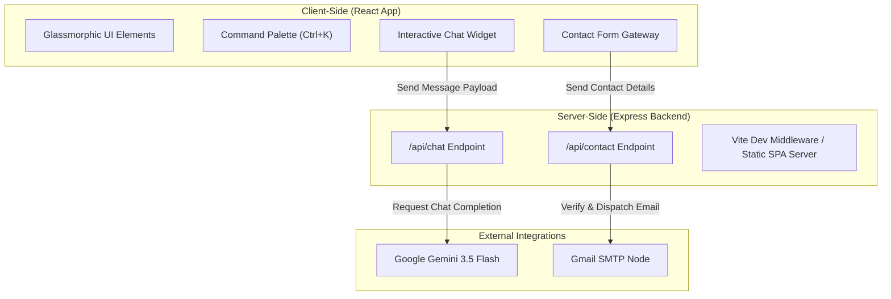

<div align="center">

# 🌐 Jaiyanth B — Premium Futuristic AI & Full-Stack Portfolio
  
[](https://vite.dev/)
[](https://react.dev/)
[](https://tailwindcss.com/)
[](https://expressjs.com/)
[](https://www.typescriptlang.org/)
[](https://ai.google.dev/)

*An immersive, dark-themed, glassmorphic portfolio designed for recruiters and tech enthusiasts. Packed with interactive animations, a keyboard-driven command palette, and an intelligent AI chatbot copilot.*

**[Explore the App in Google AI Studio](https://ai.studio/apps/4fa6e731-91e5-4935-a128-cc286a8876cc)**

</div>

---

## ⚡ Core Pillars & Interactive Features

### 🤖 1. AI Copilot Chatbot (Gemini SDK Integration)
- A conversational AI agent behaving as Jaiyanth's digital duplicate.
- Uses `@google/genai` to access **Gemini 3.5 Flash** with custom system instructions to answer questions about projects, academic scores, and skills.
- **Robust Fallback Engine**: If no API key is specified, it runs in a sandboxed offline **Demo Mode** to guide the user seamlessly.

### ⌨️ 2. Developer Command Palette
- Triggered instantly using `Ctrl + K` or `Cmd + K`.
- Keyboard-accessible interface enabling quick navigation, section jumping, theme actions, and direct links without clicking.

### 🎨 3. Immersive Premium Aesthetics
- Custom-tailored dark theme using fluid CSS mesh gradients, glowing spotlight hover overlays, and simulated ambient noise layers.
- Micro-interactions, scrolling triggers, counting stats, and spring-based layouts powered by **Motion (Framer Motion)**.

### 📨 4. Express Nodemailer Contact Bridge
- Seamlessly processes message submissions on the client side.
- Relays secure emails using an authenticated Express SMTP bridge.

---

## 🏗️ System Architecture



---

## 📁 Key Showcased Projects

| Project | Category | Key Tech Stack | Performance Metric | GitHub Repository |
| :--- | :--- | :--- | :--- | :--- |
| **Fake News Detector** | AI / ML | Flask, PostgreSQL, LLM, News API | `180ms` claim speed / `96.4%` accuracy | [GitHub Link](https://github.com/jaiyan-th/Fake-News-Detecter) |
| **Up-Skill Career Assistant**| AI Mentorship | Flask, NLP, PostgreSQL, LLM, NLTK | `4.5s` resume audit / `98.2%` coverage | [GitHub Link](https://github.com/jaiyan-th/UpSkill-AI-Personalized-Skill-and-Career-Assistant) |
| **Car-Rent Platform** | Full Stack | Next.js, SQLite, React, Tailwind, JWT | `90ms` booking sync / `<0.5ms` auth | [GitHub Link](https://github.com/jaiyan-th/Car-Rent-Main) |
| **Secure Document Vault** | Cybersecurity | FastAPI, SQLite, Argon2ID, AES-256 GCM| `42MB/s` stream decryption speed | [GitHub Link](https://github.com/jaiyan-th/Secure-Digital-Document-Vault) |

---

## 🛠️ Technology Stack Breakdown

* **Frontend**: React 19, TypeScript, Vite, Tailwind CSS, Motion, Lucide React icons.
* **Backend & API**: Express, TSX (TypeScript Execute), Dotenv, Nodemailer.
* **AI Model Engine**: Gemini 3.5 Flash (`@google/genai`).

---

## 🚀 Getting Started (Run Locally)

### Prerequisites
Make sure you have [Node.js](https://nodejs.org/) installed (version 18+ recommended).

### 1. Clone & Enter Directory
```bash
git clone https://github.com/jaiyan-th/fake-news-detector-fullstack.git
cd Jaiyanth-B-Portfolio
```

### 2. Install Dependencies
```bash
npm install
```

### 3. Setup Environment Variables
Create a `.env` file in the root directory and define the following variables:
```env
# Gemini API Key (Optional; fallback Demo Mode active if omitted)
GEMINI_API_KEY=your_gemini_api_key_here

# SMTP Email configuration (Optional; logs messages to console if omitted)
SMTP_USER=your_gmail_address@gmail.com
SMTP_PASS=your_app_specific_password_here
SMTP_HOST=smtp.gmail.com
SMTP_PORT=587
RECIPIENT_EMAIL=jaiyanthofficial@gmail.com
```

### 4. Run the Development Server
```bash
npm run dev
```
Open [http://localhost:3000](http://localhost:3000) in your browser to view the application.

### 5. Production Build & Preview
```bash
npm run build
npm run preview
```

---

## 👥 Connect with Jaiyanth B

- **Email**: [jaiyanthofficial@gmail.com](mailto:jaiyanthofficial@gmail.com)
- **LinkedIn**: [@jaiyan-th](https://linkedin.com/in/jaiyan-th)
- **GitHub**: [@jaiyan-th](https://github.com/jaiyan-th)
- **Phone**: +91 9345573281

